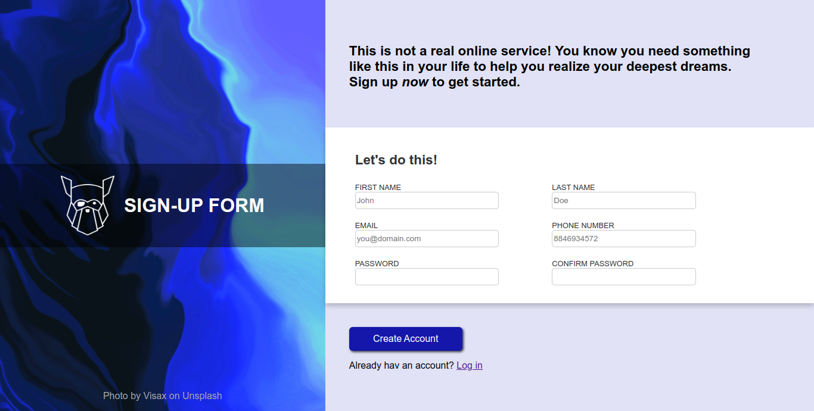

# sign-up-form
sign up form implementation from odin-project [curriculum](https://www.theodinproject.com/lessons/node-path-intermediate-html-and-css-sign-up-form)  
Live version of the form is [here](https://nerdyblock.github.io/sign-up-form/)  

## About
- custom error messages to all field.
- password validation.
- confirm password and password match.
- registration successful message on form submition.

